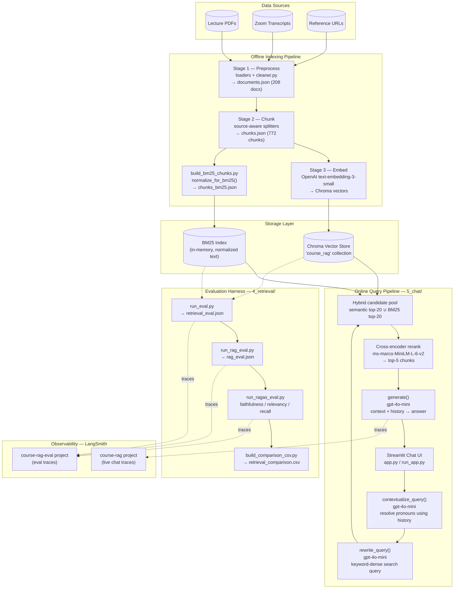

# course-rag — Architecture

End-to-end architecture of the RAG chatbot for the "Mastering Agentic AI"
course: an **offline indexing pipeline** that builds the knowledge base, an
**online query pipeline** that serves chat requests, an **evaluation
harness** that compares retrieval strategies, and **observability** via
LangSmith tracing.

---

## Key Components

### Data Sources
- **Lecture PDFs** (`data/pdfs/`) — Week 1 & 2 session slide decks
- **Zoom Transcripts** (`data/transcripts/`) — raw lecture transcripts in multiple formats (VTT, bracketed, speaker-block)
- **Reference URLs** (`data/urls.txt`) — a curated list of blog posts/papers (e.g. "Attention Is All You Need", The Illustrated Transformer)

### Offline Indexing Pipeline

| Component | Handles |
|---|---|
| **Stage 1 — Preprocess** (`1_preprocessing/`) | Loads all three source types via dedicated loaders (`pdf_loader.py`, `transcript_loader.py`, `web_loader.py`), groups transcript utterances into per-chapter documents, and filters out short/low-value content via `cleaner.py`. Output: `output/documents.json` (208 documents). |
| **Stage 2 — Chunk** (`2_chunking/`) | Splits documents into retrieval-sized passages using **source-aware** splitters — different chunk size/overlap for PDFs (800/100), transcripts (900/120), and web pages (1000/150). Output: `output/chunks.json` (772 chunks). |
| **BM25 index build** (`4_retrieval/build_bm25_chunks.py`) | Generates `output/chunks_bm25.json` — same chunks with a `normalized_text` field (lowercased, hyphens stripped) so lexical search treats variants like "BM25"/"bm25"/"Re-ranking" identically. |
| **Stage 3 — Embed** (`3_embeddings/`) | Converts each chunk into a vector using OpenAI `text-embedding-3-small` (8191-token limit, avoids the silent truncation seen with the earlier local model) and persists them to a Chroma collection. |

### Storage Layer

| Component | Handles |
|---|---|
| **Chroma Vector Store** (`vector_store/`, collection `course_rag`) | Holds all 772 chunk embeddings for dense/semantic similarity search. |
| **BM25 Index** (built in-memory at retrieval time from `chunks_bm25.json`) | Provides sparse/lexical keyword search over the normalized chunk text. |

### Online Query Pipeline (`5_chat/`)

| Component | Handles |
|---|---|
| **Streamlit Chat UI** (`app.py`, launched via `run_app.py`) | User-facing chat interface. Renders the answer with inline `[Source N]` citations and a collapsible "Sources" panel (source name, page/speaker, content preview). Maintains conversation history in `st.session_state`. |
| **`contextualize_query()`** (`4_retrieval/query_rewriter.py`) | For follow-up turns, uses `gpt-4o-mini` + prior conversation history to rewrite a question like "How does it compare to fine-tuning?" into a standalone question (resolving "it" → "RAG"). |
| **`rewrite_query()`** (`4_retrieval/query_rewriter.py`) | Reformulates the (now-standalone) question into a concise, keyword-dense search query using the corpus's technical terminology — closes retrieval gaps caused by conversational phrasing. |
| **Hybrid candidate pool** (`4_retrieval/reranker_config.py` → `get_candidate_pool()`) | Deduped union of semantic top-20 (Chroma) and BM25 top-20 results — avoids the RRF merge silently dropping chunks that rank highly in only one retriever. |
| **Cross-encoder reranker** (`cross-encoder/ms-marco-MiniLM-L-6-v2`) | Re-scores the candidate pool against the rewritten query and returns the top-5 chunks actually sent to the LLM. |
| **`generate()`** (`5_chat/generator.py`) | Builds the context block from the top-5 chunks, includes prior conversation turns, and calls `gpt-4o-mini` with a system prompt that enforces inline citations and "don't know" honesty when context is insufficient. |

### Evaluation Harness (`4_retrieval/`)

| Component | Handles |
|---|---|
| **`run_eval.py` / `run_rag_eval.py`** | Run all 10 benchmark questions through each retrieval method (semantic, BM25, hybrid, rewritten+reranked) and record retrieved chunks (`retrieval_eval.json`) and generated answers (`rag_eval.json`). |
| **`run_ragas_eval.py`** | Scores (question, method) pairs against a golden reference dataset using RAGAS metrics — faithfulness, answer relevancy, context recall — with incremental writes and resume support. |
| **`build_comparison_csv.py`** | Produces `output/retrieval_comparison.csv` — a per-question winner + rationale across all four methods, incorporating the RAGAS scores. |

### Observability — LangSmith

| Component | Handles |
|---|---|
| **`course-rag` project** | Traces from live chat sessions (`5_chat/`) — every `contextualize_query`, `rewrite_query`, retrieval, and `generate` call per user turn. |
| **`course-rag-eval` project** | Traces from evaluation script runs, kept separate so repeated eval runs don't clutter live-chat traces. Includes RAGAS's own judge/embedding calls (wrapped via `langsmith.wrappers.wrap_openai`). |
