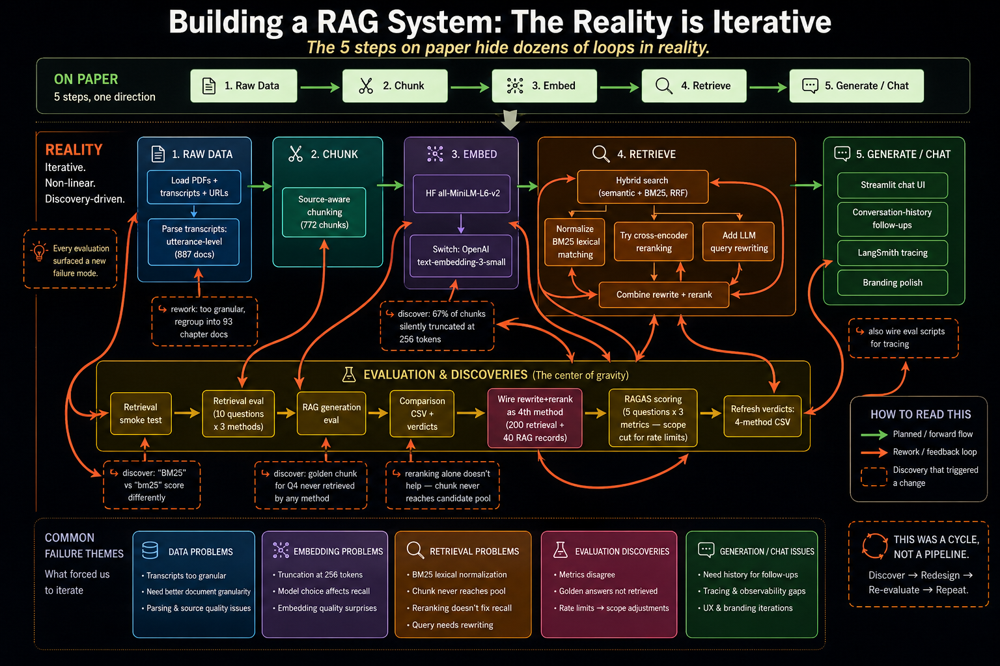

# course-rag — Mastering Agentic AI Course Assistant

A Retrieval-Augmented Generation (RAG) chatbot that answers student questions
using only the *Mastering Agentic AI* course's own material — lecture PDFs,
Zoom transcripts, and reference URLs — with inline `[Source N]` citations so
every answer is traceable back to a specific slide or transcript chapter.

[View the source on GitHub](https://github.com/usneha/agentic-ai-sneha/tree/main/course-rag)

---

## Pipeline

| Stage | What it does |
|---|---|
| 1. Preprocess | Load and clean PDFs, transcripts, and web pages into structured documents |
| 2. Chunk | Split documents into retrieval-sized passages using source-aware splitters |
| 3. Embed | Convert chunks into vector embeddings (OpenAI `text-embedding-3-small`), stored in Chroma |
| 4. Retrieve | Hybrid retrieval (semantic + BM25) with LLM-based query rewriting and cross-encoder reranking |
| 5. Generate / Chat | Streamlit chat UI (`gpt-4o-mini`) with multi-turn follow-up support and LangSmith tracing |

## Datasets

- **Lecture slide PDFs** — Week 1 (Sessions 1–2) and Week 2 (Sessions 1–2)
- **Zoom lecture transcripts** — parsed and grouped into 93 chapter-level documents (replacing an earlier 887-utterance-level approach)
- **Reference web pages** — a curated set of blog/article URLs related to course topics (e.g. "Attention Is All You Need", The Illustrated Transformer, RAG and prompt-engineering posts)
- After preprocessing and chunking: **772 total chunks** (184 from PDFs, 557 from transcript chapters, 31 from web sources)

---

## Evaluation Report

Four retrieval methods were compared: **semantic** (dense embeddings),
**bm25** (lexical), **hybrid** (RRF merge of semantic + BM25), and
**rewritten_reranked** (LLM query rewriting → hybrid candidate pool →
cross-encoder reranking).

### RAGAS scores (mean over 5 sample questions)

| Method | Faithfulness | Answer Relevancy | Context Recall |
|---|---|---|---|
| semantic | 0.9214 | 0.7891 | 0.7600 |
| bm25 | 0.9800 | 0.7338 | 1.0000 |
| hybrid | 0.9500 | 0.7891 | 0.7500 |
| **rewritten_reranked** | **0.9818** | **0.9176** | **1.0000** |

**`rewritten_reranked` wins on every metric.** The strongest signal: for the
question *"What are good ways to judge whether an LLM output is correct?"*,
`semantic`/`hybrid` both score `answer_relevancy=0.0, context_recall=0.0`
(RAGAS zeroes out the "I cannot provide a definitive answer" hedge as
noncommittal), while `rewritten_reranked` scores `1.0 / 0.99 / 1.0` — it
retrieves the right chunk and gives a grounded answer where the baseline
gives up.

### Per-question comparison (10 questions)

Click a question to see which method won and why.

<strong>How does an AI agent decide what actions to take?</strong> — Winner: Hybrid

RAGAS confirms hybrid and bm25 both score a perfect 1.0/1.0/1.0 on this question — hybrid's richer chunk mix (6-Step Framework + Primer + RAG-pipeline context) and bm25's own 6-step-framework chunk both ground complete answers covering decision criteria, action inference, and risk factors. rewritten_reranked is close (1.0/0.86/1.0) with similar retrieval but a slightly less on-target answer; semantic trails on context_recall (0.8).

<strong>How does a transformer understand relationships between words?</strong> — Winner: Rewritten+Reranked

rewritten_reranked is the only method whose answer covers all three mechanisms — self-attention, positional encoding, AND the Query/Key/Value weight matrices behind multi-headed attention — resolving the QKV gap noted in every prior run. RAGAS shows a small faithfulness trade-off (0.91 vs 1.0 for the others), but answer_relevancy and context_recall remain perfect, and the added mechanistic detail makes this the most complete answer of the four.

<strong>How do prompts influence model behavior?</strong> — Winner: Semantic

With OpenAI embeddings, semantic retrieval is now 5/5 relevant — including a new web source ("Prompt Engineering Fundamentals", Claude docs) not surfaced before — giving the LLM the richest context (anti-patterns + system/user prompt distinction + assistant pre-filling) and the most complete answer. This flips the previous winner (Hybrid), whose retrieval mix is now diluted by 2 LangChain/N8N chunks that crowd out some of semantic's strongest hits. This is also the one question where query rewriting hurts: the rewritten query drifts toward "agent"/course-structure framing instead of "prompt engineering", so rewritten_reranked's candidate pool misses the prompt-specific chunks entirely and produces the most generic of the four answers (RAGAS answer_relevancy 0.79, lowest of the four).

<strong>What are good ways to judge whether an LLM output is correct?</strong> — Winner: Rewritten+Reranked

All three original methods hedge into "I cannot provide a definitive answer" (RAGAS confirms semantic/hybrid both score 0.75/0.0/0.0 — a noncommittal response). Query rewriting reformulates this conversational question into evaluation-framework terminology, surfacing the §12 RAG EVALS chunk (RAGAS/TruLens/faithfulness/answer-relevance) that semantic and hybrid never retrieve in their top 5. rewritten_reranked instead gives a confident, grounded, multi-framework answer (RAGAS: 1.0/0.99/1.0). bm25 also does reasonably well here (1.0/0.86/1.0) via its own retrieval of related Q&A chunks, but rewritten_reranked is the clear winner — this is the headline result of the RAGAS evaluation.

<strong>What components do agentic AI systems need?</strong> — Winner: Semantic / Hybrid / Rewritten+Reranked (tie)

This flips dramatically from the prior run, where all three original methods hedged. With OpenAI embeddings, both semantic and hybrid retrieve the "A 6-Step Framework for Designing Agentic Applications" chapter-overview chunk, which explicitly enumerates the prerequisites (domain knowledge, goals, inputs, tools) for building an agentic application — letting both produce a confident, well-structured, near-identical answer. rewritten_reranked lands a near-identical RAGAS score (1.0/0.94/1.0) via a different but equally valid "AI Tech Stack" component framing (Prompt/Tool Management, RAG, Memory, Multi-Agent Systems, etc.) — both are correct answers grounded in different parts of the corpus. BM25 still misses both chunk sets and hedges; its answer_relevancy=0.0 is consistent with RAGAS's noncommittal-response scoring (same pattern as the LLM-correctness question), not a separate anomaly.

<strong>What is BM25?</strong> — Winner: Semantic / Rewritten+Reranked (tie)

Confirms the documented IDF limitation persists independent of the embedding-model swap: BM25's own retrieval still completely misses the chunks that define BM25 (the term "bm25" is too frequent across the corpus — low IDF — to be discriminative), so BM25-only retrieval and generation both fail outright. Semantic search (OpenAI embeddings) retrieves all the right slides and produces a fully cited, comprehensive answer; rewritten_reranked now matches (and arguably slightly exceeds) it — 5/5 relevant chunks including the dense+sparse "use both" recipe that semantic doesn't surface. Hybrid recovers most of it through its semantic leg.

<strong>What does the course say about Pinecone?</strong> — Winner: Semantic / Rewritten+Reranked (tie)

Same pattern as before the embedding swap: BM25's whitespace tokenizer lets common words in the natural-language query ("the", "course", "about") dominate, so it retrieves zero Pinecone-relevant chunks and fails outright. Semantic search (OpenAI embeddings) retrieves all 5 of the most relevant chunks and produces the most complete answer; rewritten_reranked's rewritten query pulls in the same ANN-index/metadata-filter/autoscaling detail plus the guest-lecture and direct Pinecone-storage chunks, producing an equally comprehensive answer. Hybrid recovers a decent but thinner answer via its semantic leg.

<strong>What does Aishwarya Srinivasan say about embeddings?</strong> — Winner: Semantic / Rewritten+Reranked (tie)

BM25 still over-indexes on the literal name "Aishwarya Srinivasan" (appearing on nearly every slide title and as a speaker label) without any pull toward "embeddings", producing 5 name-only matches and a complete non-answer — unchanged by the embedding swap, since this is a BM25 tokenization issue, not a semantic one. Semantic (OpenAI embeddings) correctly captures the speaker+topic combination and gives the most complete answer; rewritten_reranked retrieves the same three Aishwarya-Srinivasan-attributed chapters and produces an equally complete answer, including the model-selection criteria that hybrid's retrieval missed. Query rewriting doesn't help BM25 here, since the original query is dominated by a literal name regardless.

<strong>vector database</strong> — Winner: Semantic (near four-way tie)

"Vector database" remains a core, heavily-covered topic — all four methods produce comprehensive, accurate answers. Semantic edges ahead slightly by being the only one to surface Pinecone's specific managed-DB features (ANN index, metadata filters, autoscaling) alongside the general vector-DB definition; BM25, hybrid, and rewritten_reranked all give excellent but slightly more generic answers. The near-identical quality across all four confirms this remains an "easy" control case regardless of retrieval method.

<strong>How can you tell if a chatbot's answer is good or bad?</strong> — Winner: Semantic / Rewritten+Reranked (tie)

With OpenAI embeddings, semantic retrieval alone now surfaces enough chunks to combine both the online (user-feedback/follow-up-questions) and offline (relevancy/accuracy/faithfulness metrics) evaluation perspectives in a single answer — previously this required hybrid's merge of semantic + BM25 results. rewritten_reranked also combines both perspectives and additionally names the RAGAS/TruLens frameworks by name via its §12 RAG EVALS chunk, making it at least as complete as semantic. Hybrid still produces a good answer combining online feedback with qualitative metrics, but doesn't reach the relevancy/accuracy/faithfulness framing; BM25 covers only the offline-criteria perspective.

---

## Development Journey

The "textbook" RAG pipeline is 5 linear steps, but real development involved
~22 steps across 6 stages (evaluation being a 6th stage not on the original
diagram), with several rework loops:

1. **Transcript granularity** — started with 887 utterance-level transcript docs → too granular/noisy → regrouped into 93 chapter-level documents
2. **Embedding model** — started with local `all-MiniLM-L6-v2` → discovered it silently truncated 67% of chunks (256-token limit) → switched to OpenAI `text-embedding-3-small` (8191-token limit) and re-embedded everything
3. **Retrieval strategy** — semantic-only → added BM25 → combined via hybrid RRF → discovered "BM25" vs "bm25" scored differently → added lexical normalization
4. **Retrieval coverage gap** — one evaluation question's golden chunk was never retrieved by semantic, BM25, or hybrid search. Cross-encoder reranking alone didn't help (the chunk never made the candidate pool); adding LLM-based query rewriting *before* retrieval fixed it
5. **Quantitative evaluation** — built a RAGAS evaluation (faithfulness, answer relevancy, context recall) against a golden dataset, confirming "rewrite + rerank" as the best retrieval strategy across the board
6. **Conversational follow-ups** — added a `contextualize_query()` step that uses conversation history to resolve pronouns ("it"/"that") before retrieval, plus passing history into the generation prompt
7. **Observability** — added LangSmith tracing, split into two projects (`course-rag` for live chat, `course-rag-eval` for evaluation runs)

## Learnings & Observations

- **Evaluation is its own (large) stage** — not represented in any "textbook" RAG diagram, but it consumed roughly a third of total development effort and was essential for making confident decisions.
- **Embedding truncation failures are silent** — a model can quietly drop most of a chunk's content with no error, producing subtly worse retrieval that's hard to diagnose without checking token lengths directly.
- **Reranking can't fix a coverage problem** — if the right chunk never enters the candidate pool from either retriever, no amount of reranking helps. The fix had to happen *upstream*, at the query-formulation stage.
- **Lexical search is brittle to surface form** — BM25 needed explicit normalization to treat "BM25"/"bm25"/"Re-ranking"/"reranking" as equivalent.
- **Conversational state has to be threaded through two places** — both the retrieval query (to resolve what a follow-up is actually about) and the generation prompt.
- **Observability tooling pays off once a pipeline has multiple LLM calls per turn** — separating eval traces from live traces made it much easier to reason about latency and cost per stage.
